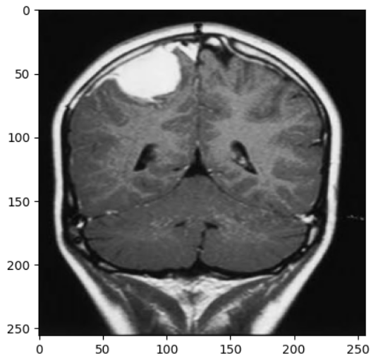

# Brain Tumor MRI Classification

This project uses a Convolutional Neural Network (CNN) to classify brain tumor types from MRI images. The model is trained and evaluated using TensorFlow and Keras.

## Project Structure

```
.
├── app/
│   └── main.py
├── datasets/
│   └── testing_images/
├── model/
│   ├── brainTumorMRIClassificationModel-v1.keras
│   └── brainTumorMRIClassificationModel-v1.pkl
├── notebooks/
│   ├── Analysis_started.ipynb
│   ├── brainTumorFinalModel.ipynb
│   └── model_testing.ipynb
├── model_dataset_lalel.txt
├── requirements.txt
└── README.md
```

## Dataset

- The dataset is downloaded from [Kaggle: Brain Tumor MRI Dataset](https://www.kaggle.com/datasets/masoudnickparvar/brain-tumor-mri-dataset).
- It contains MRI images categorized into four classes: `glioma`, `meningioma`, `notumor`, and `pituitary`.

## How to Run

1. **Install dependencies:**
   ```
   pip install -r requirements.txt
   ```

2. **Download the dataset:**
   - Place your `kaggle.json` API key in the root directory.
   - The notebook will automatically download and extract the dataset using Kaggle CLI.

3. **Train the model:**
   - Open [notebooks/brainTumorFinalModel.ipynb](notebooks/brainTumorFinalModel.ipynb) in Jupyter or VS Code.
   - Run all cells to train and evaluate the model.
   - Demo images: 
4. **Test the model:**
   - Use the provided test images in `datasets/testing_images/` or the test set from the Kaggle dataset.

## Model Architecture

- The model is a deep CNN with multiple Conv2D, BatchNormalization, MaxPooling2D, Dropout, and Dense layers.
- Input image size: 256x256x3
- Output: Softmax layer with 4 classes.

## Example Usage

```python
import tensorflow as tf

# Load model
model = tf.keras.models.load_model('model/brainTumorMRIClassificationModel-v1.keras')

# Prepare image
img = ... # Load and preprocess image to shape (256, 256, 3)

# Predict
prediction = model.predict(tf.expand_dims(img, 0))
```

## Requirements

- Python 3.8+
- TensorFlow
- Keras
- NumPy
- Pandas
- Matplotlib
- Kaggle CLI

Install all dependencies with:
```
pip install -r requirements.txt
```

## Notes

- All configuration (paths, image size, etc.) is defined directly in the notebook code.
- The model and training process are fully contained in [notebooks/brainTumorFinalModel.ipynb](notebooks/brainTumorFinalModel.ipynb).

## Streamlit App (`app/main.py`)

This project includes an interactive Streamlit web application for brain tumor MRI image classification.

**How it works:**
- The app loads a pre-trained brain tumor classification model and its class labels.
- Users can upload an MRI image (`.jpg`, `.jpeg`, `.png`).
- The app displays the uploaded image, preprocesses it (resizes to 255x255, normalizes pixel values), and predicts the tumor type.
- The predicted class is shown along with a bar chart of prediction probabilities.
- Example test images are available in the `test_images` directory for quick demos.

**Usage:**
1. Run the app:
   ```
   streamlit run app/main.py
   ```
2. Open the provided local URL in your browser.
3. Upload an MRI image to see the classification result.

**Note:**  
The app expects a model file (`model/brainTumorMRIClassificationModel-v1.pkl`) and a label file (`model_dataset_lalel.txt`) in

